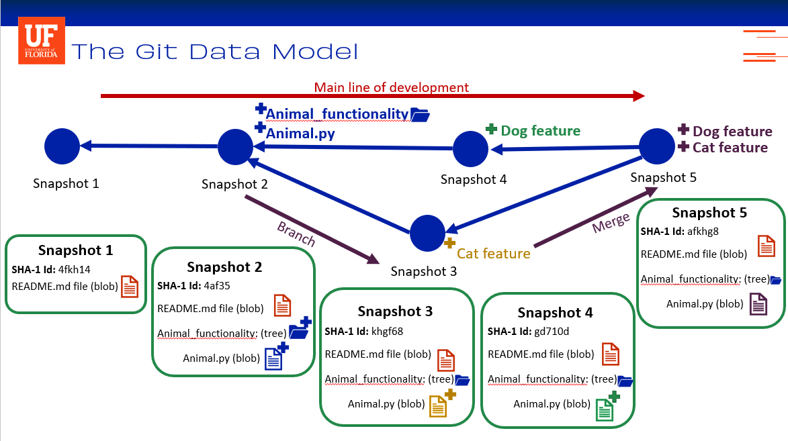
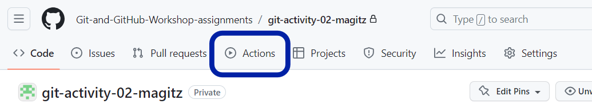
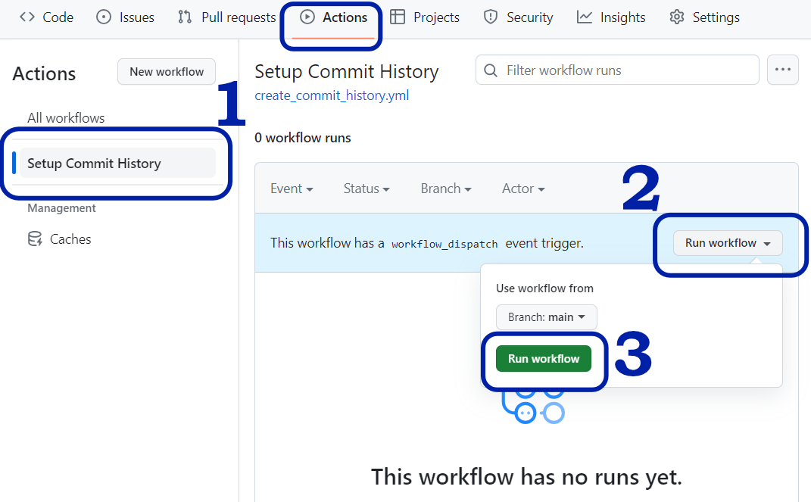
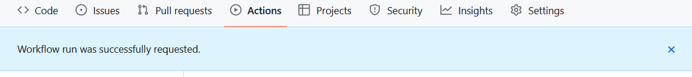
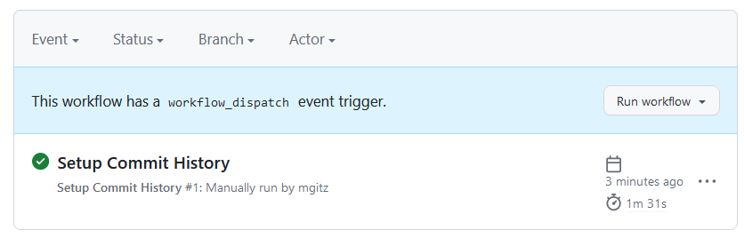
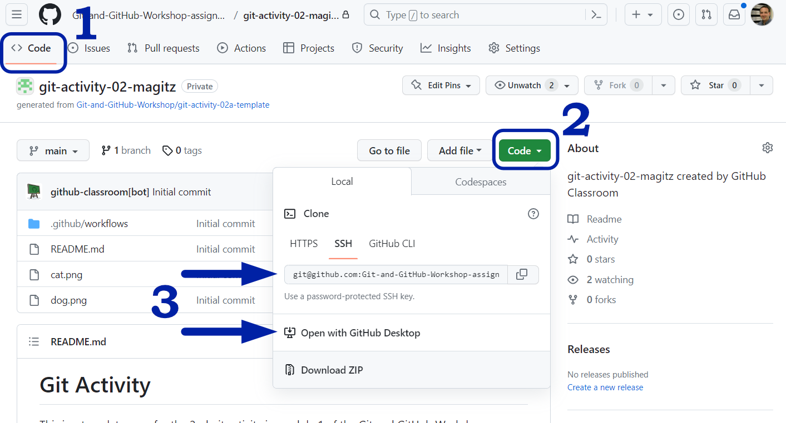

# Git Activity

This is a template repo for the 2nd git activity in module 1 of the Git and GitHub Workshop

This activity will be used along with the quiz in Canvas. The quiz will ask you questions about the repository which you can only answer by using the repo.

This activity will also mirror, in some ways, the slides from Dr. Silva's video recording. In that recording, she walked through the idea of snapshots using an example pictured below.

Remember, this repo started with a README.md file--maybe this very file you are reading now!

Then a folder called "Animal_functionality" and a Python script, "Animal.py" was added. Since we don't really want to work with Python code in this exercise, we are changing things up a bit and the new file will be a Markdown file, called "Animal.md".

Also note that the commit history, and the resulting snapshots, will be different than the simplified example used in the video.

## Instructions

You should already have the Canvas quiz that accompanies this exercise opened, if not, open it now.

1. The first step was using GitHub Classroom to accept this assignment. Done!
1. Next we need to run a GitHub Action to set things up for the exercise. We will learn more about actions later in the course, but for now, all we need to do is run the pre-set action.
   * In your repository, click on the "Actions" tab, shown below
   
   * Now, we need to run the "Setup Commit History" action. Select that on the left-hand panel, then click the "Run workflow" button on the right and from the dropdown, click the green "Run workflow button". These steps are illustrated below.
    
1. You should see a blue bar indicating your Workflow was successfully requested.

It may take a minute or two to run the workflow, but once it runs, there will be a green check next to the Setup Commit History action in the event log:

   > If you run into problems here and the workflow fails, please post in the discussion board section: [Module 1 Issues](https://github.com/orgs/Git-and-GitHub-Workshop/discussions/categories/module-1-issues).

1. Now you can clone this onto your computer to work through the quiz and answer the questions.
   * Click back on the "<>Code" tab, then click on the green "Code" button, and either copy the text string to clone the repo (to use the command line) or click the "Open with GitHub Desktop" button (to have GitHub Desktop clone the repo locally and open it)
   
1. The rest of the instructions are in the Canvas quiz. Follow the directions and answer the questions as you go.